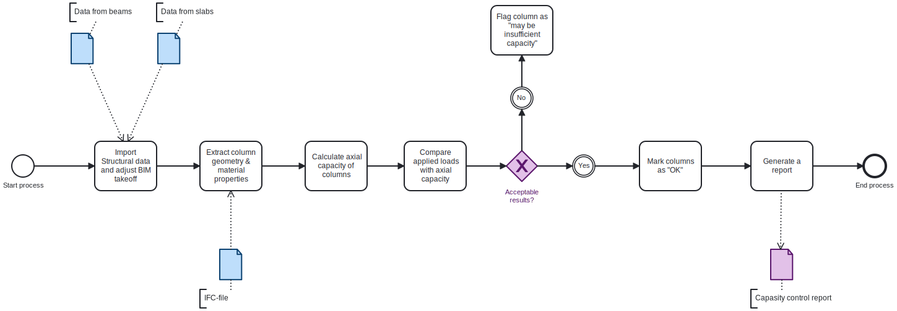

TECHNICAL UNIVERSITY OF DENMARK MSc Civil Engineering / 41934 Advanced Building Information Modeling (BIM) / 2025 Autumn Semester / Assignment 2 - Use Case / Lecturer: Associate Professor Tim Pat McGinley / Students: Ida Sofie Fiksdal s253450 & Elisa Sten-Hansen  

## A2a: About your group

**Q: How much do you agree with the following statement: I am confident coding in Python**

A: 0. This is the first time that both of us are coding in Python

Our group’s focus area is columns, and we work as analysts.

## A2b: Identify Claim

**Q: Select which building(s) to focus on for your focus area**

A: We'll be focusing at building #2516

**Q: Identify a ‘claim’ / issue / fact to check from one of those reports.**

A: As stated on page 11 of the report, the capacity is deemed sufficient. Accordingly, our assessment will focus on verifying whether the axial capacity for the columns in the first floor is adequate to resist the loads imposed by the beams and slabs from the floors above.

**Q: Justify your selection of your claim**
A: By focusing on this aspect within the BIM model, we ensure that the interaction between structural elements is properly accounted for and that potential risks of underestimation of load transfer are minimized.

## A2c: Use Case

**Q: How would you check this claim?**

A: 

1. Check the axial capacity for the columns in the basement
   - 1.1 Find the loads from the floors above
     - 1.1.1 Divide the loads per squaremeter equally per column.
     - 1.1.2 Check the area for concrete and assume reinforcement from a cross-section of the column.
     - 1.1.3 Check the design values and partial factors for concrete and steel
     - 1.1.4 (if it's not in the IFCModel, we will use the data from the report).
     - 1.1.5 Calculate the capacity of the columns.
   - 1.2 Apply loads from slabs and beams.
   - 1.3 Check if the results are okay.
2. Generate a report that shows the results.

**Q: When would this claim need to be checked?**

A: Verifying Ultimate Limit State (ULS): Axial capacity NRd against the design load effects from the slabs and beams NEd.

**Q: What information does this claim rely on?**

A: Mainly dimensions of the columns in the IFC-model, aswell as the loads from the other analysts codes.

**Q: What phase? planning, design, build or operation.**

A: During the design phase

**Q: What BIM purpose is required? Gather, generate, analyse, communicate or realise?**

A: Analyze

**Q: Review use case examples - do any of these help?, What BIM use case is this closest to? If you cannot find one from the examples, you can make a new one.**

A: 
- **08: Engineering Analysis** Ensures structural safety and compliance with codes
- **11: Phase Planning (4D Modelling)** Avoids design errors and costly rework
- **13: 3D Control and Planning** Improves planning accuracy and cost control
- **14: Construction Coordination** Reduces risk of defects and safety issues during erection
- **xx: Rehabilitation** Supports sustainable reusing of structures and avoids overdesign. (Created our own)

# BPMN drawing of our chosen use case

## A2d: Scope the use case

**Q: From the ‘whole use case’ identify where a new script / function / tool is needed. Highlight this in your BPMN diagram. Show this clearly in a new SVG diagram.**

## A2e: Tool idea

**Q: Describe in words your idea for your own OpenBIM ifcOpenShell Tool in Python.**

A: Our idea is to develop a Python-based OpenBIM tool that uses IfcOpenShell to automatically check the axial capacity of columns in a structural BIM model. Data Input (from BIM + analysis files)
The tool will read the IFC model using IfcOpenShell to extract geometry and material properties of columns (e.g., cross-sectional dimensions, concrete grade, and reinforcement data if it's there').
Additional load data will be imported from external calculation files (in this case, we hope we can use the scripts from the analysts in our group) containing beam and slab forces acting on the columns.
A report will be generated summarizing column IDs, geometry, loads, capacities, utilization and pass/fail status .

**Q: What is the business and societal value of your tool?**

A: 
- **Business Value:**
   - Efficiency & Cost Savings - Automates repetitive structural checks, reducing the time engineers spend on manual calculations and data transfer.
   - Early Risk Detection - Identifies undersized or overloaded columns early in the design, avoiding costly redesigns or construction delays.
   - Improved Collaboration - Provides transparent, model-based results that can be shared across disciplines (architects, engineers, contractors).
   - Competitive Advantage - Engineering firms that adopt automated, open-source BIM tools can deliver projects faster and with higher quality, strengthening their market position.

- **Societal Value:**
   - Safety - Ensures that critical load-bearing elements (columns) are properly dimensioned, reducing the risk of structural failure.
   - Sustainability - Helps avoid over-dimensioning, which wastes material, and under-dimensioning, which compromises safety, leading to more resource-efficient structures.
   - Accessibility - By using open-source software, the tool can be adopted by smaller firms, universities, and public projects — not just large corporations.
   
**Q: Produce a BPMN diagram to summarise your idea**

- Start Event – The process begins once load data from slabs and columns is available.
- Calculate Slab and Column Loads – The system (or script) gathers load data from previous structural analysis or simulation results.
- Calculate Column Capacity – Python scripts (using IfcOpenShell or other tools) compute the design axial capacity NRd for each column based on geometry, material data, and reinforcement details.
- Decision: Capacity Utilization OK? – The process evaluates whether the calculated load/utilization ratio for each column is within acceptable limits.
- Yes → Generate Report in Python – If utilization is acceptable, the script compiles all results into a formatted report (including column IDs, capacities, and utilization factors).
- No → End Process (requires revision) – If capacity is exceeded, the process stops and flags the relevant columns for redesign or further review.
- End Event – The process completes when all columns are evaluated and the report is generated.

## A2f: Information Requirements

**Q: Identify what information you need to extract from the model**
A:
- Dimensions for the columns
- Number of columns
- Design values and partial factors for the concrete that are used

**Q: Where is this in IFC?**
A:
We are assuming that the data is located in IfcColumn, IfcOpenShell and collections 

**Q: Is it in the model?**
A:
There is no data about the reinforcement in the model, therefor we are assuming the minimum reinforcement.

**Q:Do you know how to get it in ifcOpenShell?**
A: 
- We guess we need to either update the exicting data, or create new objects by property sets in IFCopenshell. We will figure it out. 

**Q: What will you need to learn to do this?**
A:
We need to learn how to use Python to extract the necessary data from the IFC model, add any missing information, apply loads from an external script, and generate reports directly in Python.

## A2g: Identify appropriate software licence

**Q: What software licence will you choose for your project?**

A: We will use Python as the main software for this project, asweel as Blender 4.5

